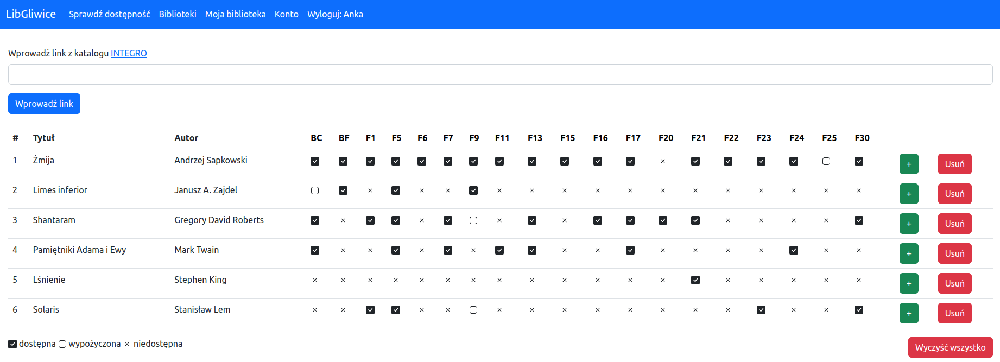

# LibGliwice
### https://libgliwice.pythonanywhere.com/
###### username: demo
###### password: TestPass123

With this app in few steps you can find where your books are available in Gliwice's library branches. It allows you to plan your visit so you will find all your books in one branch. No need to waste your time by collecting them one by one. 

## Features
* Quick view of book availability in all library's branches
* Add new branches, delete closed
* Summary of user's searches
* Mylibrary with history of books read

## Instalation
* Clone the repository 
```
$ git clone https://github.com/GrzegorzJureczko/LibGliwice.git
```
* Create virtual environment to install dependencies and activate it:
```
$ python -m venv venv
$ source venv/bin/activate
```
* Install the dependencies:
```
(env)$ pip install -r requirements.txt
```
* Create and populate database with key data:
```
$ python manage.py makemigrations
$ python manage.py migrate
$ python manage.py shell
$ from scripts import add_to_libraries
$ add_to_libraries()
```
## App dashboard

## Author
Grzegorz Jureczko